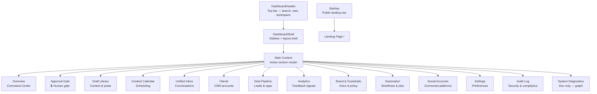

# Master Dashboard Plan v1 — SMMAI

> **Project:** SMMAI — Social Media Management Automation  
> **Repo:** `smma`  
> **Version:** v1.0  
> **Created:** 2026-09-30  
> **Branch:** `docs/master-dashboard-plan-v1`  
> **Target PR base:** `dev`  
> **Status:** 🟡 Active Planning
>
> **Phase 2 update (2026-10-02):** The Phase 2 exit-critical provisions are now
> implemented — **Social Accounts**, **Settings**, **Audit Log**, **Automation**,
> and **Approval Gate** (revision notes + batch approve). See
> [`phase2-plan-priority-review.md`](./phase2-plan-priority-review.md) for the
> prioritization and [`phase2-test-matrix.md`](./phase2-test-matrix.md) for the
> exit gate. Statuses below reflect post-implementation state.

---

## Overview

This document is the **single source of truth** for all component upgrade planning in the SMMAI dashboard. It maps every provision (section-level view inside `/dashboard`) and every header/nav component to its individual plan file. Use this as the navigation hub — drill into each linked plan for goals, API specs, props interfaces, and acceptance criteria.

---

## Architecture Map

---

## 🧩 Header Nav & Layout Component Plans

These plans cover the **shared shell** — components rendered on every page.

| Component | File | Description | Status | Plan |
|---|---|---|---|---|
| **SiteNav** | [`SiteNav.tsx`](file:///D:/citrixlabph/smma/nextjs-setup/nextjs-dashboard/src/components/layout/SiteNav.tsx) | Public landing nav — logo, section anchors, theme toggle | 🔴 Not Started | [plan-site-nav.md](./components/plan-site-nav.md) |
| **DashboardHeader** | [`DashboardHeader.tsx`](file:///D:/citrixlabph/smma/nextjs-setup/nextjs-dashboard/src/components/layout/DashboardHeader.tsx) | Top bar — sidebar toggle, search, user menu, notifications | 🔴 Not Started | [plan-dashboard-header.md](./components/plan-dashboard-header.md) |
| **DashboardShell (Sidebar)** | [`DashboardShell.tsx`](file:///D:/citrixlabph/smma/nextjs-setup/nextjs-dashboard/src/components/layout/DashboardShell.tsx) | Sidebar nav — 4 categories, 14 sections, layout shell | 🔴 Not Started | [plan-dashboard-shell-sidebar.md](./components/plan-dashboard-shell-sidebar.md) |
| **SiteFooter** | [`SiteFooter.tsx`](file:///D:/citrixlabph/smma/nextjs-setup/nextjs-dashboard/src/components/layout/SiteFooter.tsx) | Landing page footer | 🔴 Not Started | *(plan TBD)* |

---

## 🏛️ Dashboard Provision Plans

Provisions are the **section-level views** rendered inside the dashboard when a nav item is selected.

### Publishing & Editorial

| Provision | Section ID | Status | Plan |
|---|---|---|---|
| **Overview** | `overview` | 🟡 In Progress | [plan-provision-overview.md](./components/plan-provision-overview.md) |
| **Approval Gate** | `approval` | 🟢 Phase 2 Implemented | [plan-provision-approval-gate.md](./components/plan-provision-approval-gate.md) |
| **Draft Library** | `drafts` | 🟡 In Progress | [plan-provision-draft-library.md](./components/plan-provision-draft-library.md) |
| **Content Calendar** | `calendar` | 🔴 Not Started | [plan-provision-content-calendar.md](./components/plan-provision-content-calendar.md) |

### Engagement & CRM

| Provision | Section ID | Status | Plan |
|---|---|---|---|
| **Unified Inbox** | `inbox` | 🔴 Not Started | *(plan TBD — use template)* |
| **Clients** | `clients` | 🟡 In Progress | [plan-provision-clients.md](./components/plan-provision-clients.md) |
| **Deal Pipeline** | `pipeline` | 🟢 Built (status was stale) | [plan-provision-pipeline.md](./components/plan-provision-pipeline.md) |

### Intelligence & Quality

| Provision | Section ID | Status | Plan |
|---|---|---|---|
| **Analytics** | `analytics` | 🟡 In Progress | [plan-provision-analytics.md](./components/plan-provision-analytics.md) |
| **Brand & Guardrails** | `guardrails` | 🟡 In Progress | [plan-provision-guardrails.md](./components/plan-provision-guardrails.md) |
| **Automation** | `automation` | 🟢 Phase 2 Implemented | [plan-provision-automation.md](./components/plan-provision-automation.md) |

### Workspace & System

| Provision | Section ID | Status | Plan |
|---|---|---|---|
| **Social Accounts** | `accounts` | 🟢 Phase 2 Implemented | [plan-provision-accounts.md](./components/plan-provision-accounts.md) |
| **Settings** | `settings` | 🟢 Phase 2 Implemented | [plan-provision-settings.md](./components/plan-provision-settings.md) |
| **Audit Log** | `audit` | 🟢 Phase 2 Implemented | [plan-provision-audit-log.md](./components/plan-provision-audit-log.md) |
| **System Diagnostics** | `graph` | 🟡 Built (status was stale) | *(dev-only — plan TBD)* |

---

## 🌐 Landing Page Section Plans

Public-facing sections rendered on `/` (home).

| Section | Component | Status | Plan |
|---|---|---|---|
| **Hero** | [`HeroSection.tsx`](file:///D:/citrixlabph/smma/nextjs-setup/nextjs-dashboard/src/components/sections/HeroSection.tsx) | 🔴 Not Started | *(plan TBD)* |
| **How It Works** | [`WorkflowSection.tsx`](file:///D:/citrixlabph/smma/nextjs-setup/nextjs-dashboard/src/components/sections/WorkflowSection.tsx) | 🔴 Not Started | *(plan TBD)* |
| **Architecture** | [`ArchitectureSection.tsx`](file:///D:/citrixlabph/smma/nextjs-setup/nextjs-dashboard/src/components/sections/ArchitectureSection.tsx) | 🔴 Not Started | *(plan TBD)* |
| **Highlights** | [`HighlightsStrip.tsx`](file:///D:/citrixlabph/smma/nextjs-setup/nextjs-dashboard/src/components/sections/HighlightsStrip.tsx) | 🔴 Not Started | *(plan TBD)* |
| **Security** | [`SecuritySection.tsx`](file:///D:/citrixlabph/smma/nextjs-setup/nextjs-dashboard/src/components/sections/SecuritySection.tsx) | 🔴 Not Started | *(plan TBD)* |
| **Roadmap** | [`RoadmapSection.tsx`](file:///D:/citrixlabph/smma/nextjs-setup/nextjs-dashboard/src/components/sections/RoadmapSection.tsx) | 🔴 Not Started | *(plan TBD)* |
| **CTA Band** | [`CtaBand.tsx`](file:///D:/citrixlabph/smma/nextjs-setup/nextjs-dashboard/src/components/sections/CtaBand.tsx) | 🔴 Not Started | *(plan TBD)* |

---

## 🔩 Shared UI Component Plans

| Component | File | Status | Notes |
|---|---|---|---|
| `Button` | [`components/ui/Button.tsx`](file:///D:/citrixlabph/smma/nextjs-setup/nextjs-dashboard/src/components/ui/Button.tsx) | 🔴 Not Started | Add variants: primary, ghost, destructive |
| `StatusPill` | [`components/ui/StatusPill.tsx`](file:///D:/citrixlabph/smma/nextjs-setup/nextjs-dashboard/src/components/ui/StatusPill.tsx) | 🔴 Not Started | Extend for all draft status types |
| `PhaseBadge` | [`components/ui/PhaseBadge.tsx`](file:///D:/citrixlabph/smma/nextjs-setup/nextjs-dashboard/src/components/ui/PhaseBadge.tsx) | 🔴 Not Started | Pipeline phase indicator |
| `ArchCard` | [`components/ui/ArchCard.tsx`](file:///D:/citrixlabph/smma/nextjs-setup/nextjs-dashboard/src/components/ui/ArchCard.tsx) | 🔴 Not Started | Architecture display card |
| `DashboardCard` | [`components/dashboard/DashboardCard.tsx`](file:///D:/citrixlabph/smma/nextjs-setup/nextjs-dashboard/src/components/dashboard/DashboardCard.tsx) | 🔴 Not Started | KPI card — add trend sparkline |
| `ContentDraftCard` | [`components/crm/ContentDraftCard.tsx`](file:///D:/citrixlabph/smma/nextjs-setup/nextjs-dashboard/src/components/crm/ContentDraftCard.tsx) | 🟡 In Progress | Add platform icon, action buttons |
| `ClientStatsCards` | [`components/crm/ClientStatsCards.tsx`](file:///D:/citrixlabph/smma/nextjs-setup/nextjs-dashboard/src/components/crm/ClientStatsCards.tsx) | 🟡 In Progress | Add engagement trend |
| `GraphExplorer` | [`components/dashboard/GraphExplorer.tsx`](file:///D:/citrixlabph/smma/nextjs-setup/nextjs-dashboard/src/components/dashboard/GraphExplorer.tsx) | 🔴 Not Started | Repurpose for analytics or graphify view |
| `SkeletonCard` | *(new)* | 🔴 Not Started | Loading skeleton for KPI cards |
| `UserMenu` | *(new)* | 🔴 Not Started | Avatar dropdown in DashboardHeader |
| `WorkspaceSwitcher` | *(new)* | 🔴 Not Started | Multi-workspace selector |

---

## 📋 Plan File Index

All individual plan files live in `docs/plans/components/`.

### Header Nav & Layout Plans
- [`plan-site-nav.md`](file:///D:/citrixlabph/smma/docs/plans/components/plan-site-nav.md) — Public site navigation
- [`plan-dashboard-header.md`](file:///D:/citrixlabph/smma/docs/plans/components/plan-dashboard-header.md) — Dashboard top header bar
- [`plan-dashboard-shell-sidebar.md`](file:///D:/citrixlabph/smma/docs/plans/components/plan-dashboard-shell-sidebar.md) — Sidebar nav + layout shell

### Provision Plans
- [`plan-provision-overview.md`](file:///D:/citrixlabph/smma/docs/plans/components/plan-provision-overview.md) — Command Center (default landing)
- [`plan-provision-approval-gate.md`](file:///D:/citrixlabph/smma/docs/plans/components/plan-provision-approval-gate.md) — Human approval checkpoint
- [`plan-provision-draft-library.md`](file:///D:/citrixlabph/smma/docs/plans/components/plan-provision-draft-library.md) — All content drafts
- [`plan-provision-content-calendar.md`](file:///D:/citrixlabph/smma/docs/plans/components/plan-provision-content-calendar.md) — Scheduling calendar
- [`plan-provision-clients.md`](file:///D:/citrixlabph/smma/docs/plans/components/plan-provision-clients.md) — CRM client accounts
- [`plan-provision-pipeline.md`](file:///D:/citrixlabph/smma/docs/plans/components/plan-provision-pipeline.md) — Sales deal Kanban
- [`plan-provision-analytics.md`](file:///D:/citrixlabph/smma/docs/plans/components/plan-provision-analytics.md) — Engagement & rank signals
- [`plan-provision-guardrails.md`](file:///D:/citrixlabph/smma/docs/plans/components/plan-provision-guardrails.md) — Brand & moderation policy
- [`plan-provision-automation.md`](file:///D:/citrixlabph/smma/docs/plans/components/plan-provision-automation.md) — Workflows & cron jobs
- [`plan-provision-accounts.md`](file:///D:/citrixlabph/smma/docs/plans/components/plan-provision-accounts.md) — Social platform connections
- [`plan-provision-settings.md`](file:///D:/citrixlabph/smma/docs/plans/components/plan-provision-settings.md) — Workspace & user preferences
- [`plan-provision-audit-log.md`](file:///D:/citrixlabph/smma/docs/plans/components/plan-provision-audit-log.md) — Security & compliance log

---

## 📊 Progress Summary

| Category | Total | Not Started | In Progress | Done |
|---|---|---|---|---|
| Header Nav & Layout | 4 | 4 | 0 | 0 |
| Publishing & Editorial provisions | 4 | 3 | 1 | 0 |
| Engagement & CRM provisions | 3 | 2 | 1 | 0 |
| Intelligence & Quality provisions | 3 | 3 | 0 | 0 |
| Workspace & System provisions | 4 | 4 | 0 | 0 |
| Landing Page sections | 7 | 7 | 0 | 0 |
| Shared UI components | 11 | 9 | 2 | 0 |
| **Total** | **36** | **32** | **4** | **0** |

---

## 🔗 Related Documentation

| Document | Purpose |
|---|---|
| [`AGENTS.md`](file:///D:/citrixlabph/smma/AGENTS.md) | Project rules — DRY_RUN, antislop, dev commands |
| [`DESIGN.md`](file:///D:/citrixlabph/smma/DESIGN.md) | Visual design direction |
| [`antislop.md`](file:///D:/citrixlabph/smma/antislop.md) | Anti-slop rules for UI/copy/code |
| [`crm-plan-v2.md`](file:///D:/citrixlabph/smma/crm-plan-v2.md) | CRM feature plan (v2) |
| [`smmai-plan-v3.md`](file:///D:/citrixlabph/smma/smmai-plan-v3.md) | Full system plan (v3) |
| [`src/tokens.css`](file:///D:/citrixlabph/smma/nextjs-setup/nextjs-dashboard/src/tokens.css) | Design token source |
| [`src/lib/crm.ts`](file:///D:/citrixlabph/smma/nextjs-setup/nextjs-dashboard/src/lib/crm.ts) | CRM section type definitions |
| [`src/smm/domain/models.py`](file:///D:/citrixlabph/smma/src/smm/domain/models.py) | Core Python domain models |
| [`src/smm/publishing/service.py`](file:///D:/citrixlabph/smma/src/smm/publishing/service.py) | Publishing service with approval gate |
| [`src/smm/moderation/policy.py`](file:///D:/citrixlabph/smma/src/smm/moderation/policy.py) | Brand moderation policy |
| [`src/smm/analytics/feedback.py`](file:///D:/citrixlabph/smma/src/smm/analytics/feedback.py) | Engagement rate computation |

---

## ⚠️ Critical Rules (from AGENTS.md)

> [!IMPORTANT]
> **DRY_RUN=true is the safe default.** No content is ever published for real without explicit human approval at the Approval Gate. The publish button must show "Simulate" in dry-run mode — never "Publish".

> [!WARNING]
> **Antislop applies to all UI work.** Before starting any visual, copy, or layout work, read `antislop.md` and the relevant skill file (`skills/antislop-ui/SKILL.md` for UI, `skills/antislop-layoutmobile/SKILL.md` for mobile layout).
